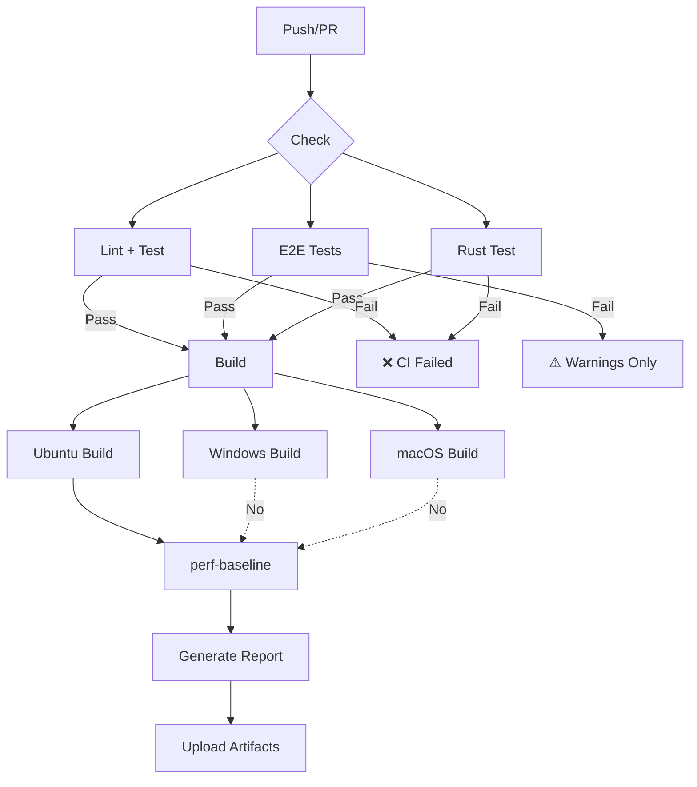

# E2E 测试 CI 集成指南

本文档说明如何将 Playwright E2E 测试集成到 GitHub Actions CI 流程中。

---

## 一、工作流概览

当前 CI 配置 (`.github/workflows/ci.yml`) 包含以下关键 job：

### 1. **e2e** - E2E 测试 (Playwright)
- **运行时机**: PR 推送到 `main`/`develop` 分支或创建 PR 时
- **运行环境**: Ubuntu Latest
- **超时时间**: 30 分钟
- **测试内容**:
  - ✅ 应用加载测试 (`app-loading.spec.ts`)
  - ✅ 宠物交互测试 (`pet-interaction.spec.ts`)  
  - ✅ 无障碍测试 (`accessibility.spec.ts`)
  - ⚠️ 系统功能测试 (`memory-system.spec.ts`, `inventory-system.spec.ts`) - 依赖 UI 存在对应入口

### 2. **perf-baseline** - 性能基线测试
- **运行时机**: 构建成功后自动触发
- **运行环境**: Ubuntu Latest
- **超时时间**: 20 分钟
- **测试内容**:
  - ⏱️ 冷启动时间 (<2s)
  - 💾 内存占用 (<80MB)
  - 🎬 FPS 测试 (≥30)
  - 🔄 模型切换延迟 (<500ms) - **[新增]**

### 3. **perf-stress** - 压力测试
- **运行时机**: 每次 PR/Push
- **运行内容**:
  - 内存泄漏测试
  - 压力测试

---

## 二、本地调试 CI 流程

在推送前本地模拟 CI 环境测试：

```bash
# 1. 安装 Playwright 浏览器
pnpm exec playwright install --with-deps chromium

# 2. 启动 dev server (后台)
pnpm dev &
sleep 10

# 3. 运行 E2E 测试
pnpm test:e2e

# 4. 运行性能测试
pnpm perf:cold-start
pnpm perf:memory
pnpm perf:fps
pnpm perf:model-switch
pnpm perf:report  # 生成综合报告
```

---

## 三、GitHub Actions 执行流程



### 关键点说明

1. **E2E 测试失败不会阻断合并** (`continue-on-error: true`)
   - 原因：部分测试依赖 UI 实现细节
   - 实践：查看报告手动确认问题

2. **性能测试依赖构建产物**
   - `perf-baseline` job 需要 `build` job 的 Ubuntu 构建结果
   - 通过 artifact 下载传递

3. **测试结果保留策略**
   - Playwright 报告：14 天
   - 性能基准数据：30 天
   - 失败视频截图：7 天

---

## 四、常见问题排查

### Q1: E2E 测试超时

**症状**: `Timeout 30000ms exceeded`

**可能原因**:
- Dev server 启动慢
- Live2D 模型加载慢
- 网络资源阻塞

**解决方案**:
```yaml
# 增加超时时间
- name: Run E2E tests
  run: pnpm exec playwright test --timeout=60000
```

### Q2: Playwright 浏览器安装失败

**症状**: `Failed to launch browser`

**解决方案**:
```yaml
- name: Install Playwright dependencies
  run: |
    sudo apt-get update
    sudo apt-get install -y \
      libnss3 \
      libnspr4 \
      libatk1.0-0 \
      libatk-bridge2.0-0 \
      libcups2 \
      libdrm2 \
      libdbus-1-3 \
      libxkbcommon0 \
      libgbm1 \
      libasound2
```

### Q3: 性能测试找不到 exe

**症状**: `Error: Executable not found: spiritpal-app`

**解决方案**:
检查 build job 是否成功，artifact 名称是否匹配：
```yaml
# perf-baseline 中的 artifact 名称
- name: Download build artifacts
  uses: actions/download-artifact@v4
  with:
    name: spiritpal-build-ubuntu-22.04  # 必须与 build job 一致
```

### Q4: 视频截图上传失败

**症状**: `Artifact upload failed: No files found`

**原因**: 测试未失败，无视频生成

**不影响**: 这是正常行为，仅在失败时保留证据

---

## 五、查看测试结果

### 1. GitHub Actions 界面

1. 进入仓库 → Actions 标签
2. 选择对应的工作流运行 (如 "E2E Tests")
3. 查看日志和错误详情

### 2. 下载 Playwright 报告

```bash
# 从 Actions 页面下载 playwright-report.zip
# 解压后用浏览器打开 index.html
unzip playwright-report.zip
open playwright-report/index.html  # macOS
explorer playwright-report\index.html  # Windows
```

### 3. 性能基准报告

```markdown
# 在 perf/benchmark-report.md 中查看
# GitHub Actions 会自动上传为 artifact

## 指标总览
| 指标 | 当前值 | 阈值 | 状态 |
|------|--------|------|------|
| 冷启动时间 | 1850ms | <2000ms | ✅ 通过 |
| 内存占用 | 65MB | <80MB | ✅ 通过 |
| FPS | 35 | ≥30 | ✅ 通过 |
| 模型切换延迟 | 420ms | <500ms | ✅ 通过 |
```

---

## 六、优化建议

### 并行化测试

当前所有 E2E 测试串行运行，可考虑分片：

```yaml
- name: Run E2E tests (shard 1/3)
  run: pnpm exec playwright test --shard=1/3
- name: Run E2E tests (shard 2/3)
  run: pnpm exec playwright test --shard=2/3
- name: Run E2E tests (shard 3/3)
  run: pnpm exec playwright test --shard=3/3
```

### 缓存浏览器

加速浏览器安装：

```yaml
- name: Cache Playwright browsers
  uses: actions/cache@v4
  with:
    path: ~/.cache/ms-playwright
    key: playwright-browsers-${{ runner.os }}-${{ hashFiles('package.json') }}
```

### 启用失败重试

针对不稳定测试：

```yaml
- name: Run E2E tests
  run: pnpm exec playwright test --retries=2
```

---

## 七、扩展场景

### 添加新的测试文件

1. 在 `tests/e2e/` 创建 `.spec.ts` 文件
2. 修改 CI 配置添加测试命令：

```yaml
- name: Run new feature tests
  run: pnpm exec playwright test tests/e2e/new-feature.spec.ts
```

### 多浏览器测试

```yaml
- name: Run on Chromium
  run: pnpm exec playwright test --project=chromium

- name: Run on Firefox
  run: pnpm exec playwright test --project=firefox

- name: Run on WebKit
  run: pnpm exec playwright test --project=webkit
```

### Tauri 构建产物测试

使用真实 Tauri 应用测试而非 dev server：

```yaml
- name: Start Tauri app
  run: |
    ./src-tauri/target/release/spiritpal-app &
    sleep 15  # 等待应用启动
  
- name: Run E2E against built app
  run: pnpm exec playwright test --grep @tauri-only
```

---

## 附录：相关配置文件

| 文件 | 用途 |
|------|------|
| `.github/workflows/ci.yml` | CI 主配置 |
| `playwright.config.ts` | Playwright 测试配置 |
| `tests/e2e/README.md` | E2E 测试使用说明 |
| `.env.example` | 环境变量模板 |
